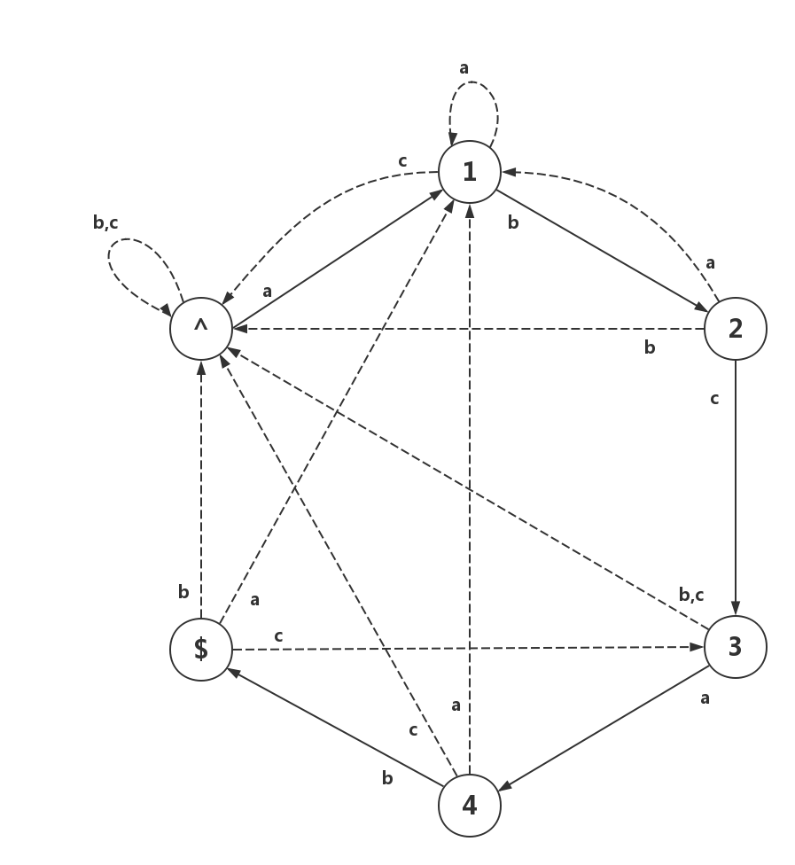

# 模式匹配问题——自动机家族 #

　　所谓模式匹配，是指给定一个模式串，要求在某个文本串中找出与该模式串相同的所有子串、前缀、后缀等。假定目标串是一个长度为n的数组T[1:n]，而模式串是一系列长度为m的数组$P_i[1:m]$，其中$m \leq n$。求出所有有效的偏移s和对应的模式i，使得T的子串$T[s+1:s+m] = P_i[1:m]$。
```
模式匹配问题：已知目标串与模式串，求所有符合要求的偏移s的集合

Target string  : a b c a b a a b c a b a c
Pattern string :       a b a a                   (s = 3)
```
　　模式匹配问题是字符串专题最重要的内容。本章节的所有算法，均用作相应的特定模式匹配问题的求解。如KMP算法用于单模式串的匹配问题，AC自动机用于多模式串的匹配问题，后缀自动机的模式是一个字符串的所有后缀……

[TOC]

## 从有向图到自动机 ##

### 问题描述 ###

　　**字符串的匹配问题**是计算机领域的一个经典问题。为了简化问题，首先考虑单模式的匹配问题。为了对这一问题进行分析，给出有关定义和符号约定如下：

  * 子串(substring):指字符串中，位置连续的若干个字符所组成的新串,记号T[3:7]表示字符串T从第3个字符到第7个字符表示的子串（闭区间）。
    例如："string"是T="substring"的子串，T[4:10]="string"。
  * 匹配(matching)：指在目标串中搜索相应位置的子串等同于模式串的过程。
    例如：在“Let**splay**basketball”中搜索"splay"，得知有效偏移s为3。
  * 目标串(Target string)：被搜索的串，用T表示。
    例如：上例中的"Letsplaybasketball"。
  * 模式串(Pattern string)：用于搜索的串，它往往是目标串的一小个片段，用P表示。
    例如：上例中的"splay"。

　　朴素的解决方法是枚举偏移s，并一一比对模式串与目标串的字符是否相等。下表表示朴素解决方法的运行过程：

|s|c|a|b|a|b|c|a|b|a|b|a|c|
|-|-|-|-|-|-|-|-|-|-|-|-|-|
|1|(a)|b|c|a|b| | | | | | | |
|2| |a|b|(c)|a|b| | | | | | |
|3| | |(a)|b|c|a|b| | | | | |
|4| | | |a|b|c|a|b| | | | |
|5| | | | |(a)|b|c|a|b| | | |
|6| | | | | |(a)|b|c|a|b| | |
|7| | | | | | |a|b|(c)|a|b| |
|8| | | | | | | |(a)|b|c|a|b|

　　由于每当一个字符匹配成功时需要继续往下比较下一个字符，对每一个s都需要比较m次，总的时间复杂度为$O(nm)$。可以注意到，这个操作造成了大量的T中字符的重复读取，比较————当前字符属于多少个子串，就需要比对多少次！如果能设法降低这个次数，那整个问题的处理时间将会大大降低。

### 简要步骤 ###

　　下面介绍一个线性时间的算法，为了便于读者对自动机有一个感性的认识，下面先不加说明地给出一个"有限自动机"实例：



　　从实质上来说，该实例是一个有向图，它由点(Vertices)与边(Edges)构成。所不同的是，该有向图的边的属性是一个个的字母，而非我们熟悉的距离、流容量等一个个的数值。
　　在解释这个实例是什么、怎么得到的之前，请读者亲自动手进行如下操作：给定目标串`cababcababac`，从`^`点出发，自左向右依次读取目标串的字符，并根据图上的边的属性进行移动。当到达`$`点时，记录下此时读取的字符所在的位置。
```
实例1：利用“自动机”完成匹配工作。

index  :  0  1  2  3  4  5  6  7  8  9  10 11 12
Target :     c  a  b  a  b  c  a  b  a  b  a  c
State  :  ^  ^  1  2  1  2  3  4  $  1  2  1  ^
```
　　事实上，在我们进行这个操作的过程时，我们就完成了对该目标串的匹配工作。`$`所在的位置正是匹配串在目标串中出现位置的结尾（index = 8）处。经过这样的操作，我们仅需一遍遍历，就找出了目标串的全部匹配。这便是大名鼎鼎的“有限自动机”用于字符串匹配的一个实例。在这个自动机中，我们关注两个概念:

 * 状态（state），对应有向图的点。
 * 状态转移(transfer)，对应有向图的边。边上的字母是状态转移的条件。

　　到此，我们对自动机有了一个感性的认识。后面读者将会看到，这个自动机各个状态的意义是什么，而它又是如何构建的。

## 单模式串匹配问题——KMP算法 ##

### 匹配过程的改进 ###

　　接下来，我们开始系统性地介绍一种用于单模式串匹配的算法。如上所述，朴素算法的问题就在于重复比较，为了避免这个问题，我们对算法作出如下改进：

 * 关注以当前位置为结束值的**最大前缀匹配**
 * 通过“失配跳转”，从原最大前缀匹配直接跳转到新的合法的最大前缀匹配
 * 运用预处理的方法计算出最大前缀匹配改变时的新匹配

　　基于改进1，我们可以得知在当前**最大前缀匹配**之前的所有字符无法再产生新匹配，因此，这些字符在后续的处理中不会再被访问；而改进2的基础在于，由于目前有用的字符均是**模式串**的前缀信息，它是模式串当前前缀的固有属性，不依赖于目标串的内容，所有可以在预处理期内完成。
　　已知模式串`abababc`，目标串`ccaaabcab`举例如下：
```
实例2：关注“最大前缀匹配”，采用失配跳转进行匹配过程

index    :  1  2  3  4  5  6  7  8  9  10 11 12 13
Target   :  c  c  a  b  a  b  a  b  a  b  c  a  b
                                 ^  ?
Pattern1 :        a  b  a  b  a  b  c ...
Pattern2 :              a  b  a  b  a ...
```
　　此处有一定的思维难度，建议读者多多观察样例，动手试着做一下。

### 前缀函数 ###

　　我们可以利用一个数组记录模式串在各个当前前缀的“固有属性”，称作**前缀函数**。所谓“前缀”，是指当前前缀的**最大首尾匹配**：

　　定义：对于长度为m的字符串$p$，若存在$0 < j < m$，使$p[1: j]=p[m-j+1: m]$，则称这个长度的最大值$j_{max}$所表示的子串$p[1: j_{max}]$为字符串$p$的**最大首尾匹配**。特别的，若不存在这样的j值，则该字符串的最大首尾匹配为空串，相应的j取0。

　　可以求出，当p = `ababab`时，首尾匹配的j=4，回到此前的例子之中：
```
实例3：最大首尾匹配

Pattern1:  a  b  a  b  a  b  (c) ...
Pattern2:        a  b  a  b  (a) ...
```
　　新的最大前缀匹配在公共部分的长度正好等于该点处的最大首尾匹配！由此我们可以看出，各个前缀的最大首尾匹配可以用来构建“失配跳转”。

　　最后我们给出这种前缀函数的完整描述：对于模式串P，定义前缀函数`j = N(index)`，使j为模式串P长度为index的前缀的最大首尾匹配的值：
```
实例4：前缀函数

index       :  1  2  3  4  5  6  7
Pattern     :  a  b  a  b  a  b  c
next(index) :  0  0  1  2  3  4  0
```
　　通过该前缀函数，我们可以在$O(n)$的时间内完成匹配工作，算法代码如下：
```cpp
//p: pattern, next: 前缀函数, t: target, s:储存所有合法偏移量的结果
//函数返回合法的匹配个数
int match(const char p[], const int next[], const char t[], int s[])
{
    int l = strlen(t);
    int ans = 0;    //保存合法匹配的个数
    int j = 0;
    for(int i=0; i<l; i++){
        int k=j;

        //自前一个点的前缀匹配开始比较，若失败则利用前缀函数跳转，直至匹配前缀为空
        for(j=0; k>=0; k=next[k])
            if(t[i] == p[k]){
                j = k+1;
                break;
            }
        if(p[j] == '\0')
            //匹配成功后的操作，这里把偏移量存下来返回给了main函数
            s[ans++] = i+1-j;
    }
    return ans;
}
```
### 前缀函数的计算 ###

　　计算前缀函数，实质是就是计算**各前缀**的最大首尾匹配。感官上，对单个字符串的最大首尾匹配，似乎只能枚举j值，再逐次进行比较检查该首尾匹配的合法性。简单分析可知，该过程的时间复杂度为$O(m^2)$，采用这种方法计算所有前缀的最大首尾匹配，复杂度能高达$O(m^3)$。
　　但是利用**递推**的思想，我们能在$O(m)$，即线性的时间内求出所有前缀的最大首尾匹配。详细过程如下：

问题：对于字符串P，已知x = 1, 2, ..., k-1时前缀函数next(x)的值，求x = k时前缀函数next(x)的值？

解答：
 1. 当$P[k] = P[N(k-1) + 1]$时，那么k的最大首尾匹配就只是k-1的最大首尾匹配(包括空串)增加一个字符，$N(k) = N(k-1) + 1$。
 2. 当1中条件不被满足时，若k的的最大首尾匹配是k-1处某一非最大首尾匹配(包括空串)增加一个字符。因此，可以对这些首尾匹配一一进行比对，注意到k-1的非最大首尾匹配集合$sub = \{N(N(k-1)), N(N(N(k-1))), ..., 0\}$，此时$N(k) = max(sub_i|P[k] = P[sub_i + 1])$ 。
 3. 当1、2中条件均不被满足时，最大首尾匹配不存在，$N(k) = 0$。

```
实例5.1
i       :  1  2  3  4  5  6  7  8
P       :  a  b  c  a  b  a  b  c
                       ^
P_match :           a (b)
next(i) :  0  0  0  1->2

实例5.2
i       :  1  2  3  4  5  6  7  8
P       :  a  b  c  a  b  a  b  c
                          ^
P_match1:           a  b (c)
P_match2:          (null) a
next(i) :  0  0  0  1  2->1
```
　　附上前缀函数生成代码如下：
```cpp
//p: pattern, next 前缀函数（用数组存）, 约定pattern是0-indexed的，next是1-indexed的，即next[i+1] 代表子串p[0:i]的首尾最大匹配
void getnext(const char p[], int next[])
{
    next[0] = -1;  //Tricky: 设为负数，便于跳出循环
    next[1] = 0;
    int l = strlen(p);
    for(int i=1; i<l; i++){
        //情形3：新的首尾最大匹配为空
        next[i+1] = 0;
        for(int j=next[i]; j>=0; j=next[j])
            //情形1与情形2：新的首尾最大匹配为前最大匹配之一
            if(p[i] == p[j]){
                next[i+1] = j+1;
                break;
            }
    }
}
```
### 算法正确性证明与复杂度分析 ###

先证明匹配过程的正确性：

　　在过程中，若$P[1..q]$ 与$T[s+1...s+q]$ 匹配，而$P[q+1]$与$T[s+q+1]$ 失配，那么由$N$的定义可立即得出$P[1..N[q]]$ 与 $T[s+q-N[q]+1...s+q]$ 匹配，而二者之间的首尾匹配$T[1...t]$与$T[s+q-t+1...s+q] (T[q] < t < q) $失配，即只需检验$P[N[q]+1]$ 与$T[s+q+1]$ 的匹配情况即可，匹配过程的正确性即可得证。

接下来证明前缀函数$N$计算的正确性：

（施工中，算导中文第三版P593）

接下来证明KMP算法的时间复杂度：

　　对于**匹配过程**，第k个位置需要常数次读写和$b_k$次失配跳转，计时间花费$T(k)=T(k-1) + c + b_k$。而由于每经过一次匹配之后，前缀匹配的长度至少减少1，有第k个位置的前缀函数：
$$
N(k) \leq N(k-1) - b_k + 1
$$
移项，整理得：
$$
\sum_{i=1}^n b_k \leq \sum_{i=1}^n (N(k-1) - N(k)) + n = n - N(m)\\
T(n) \leq cn + n\\
T(n) \sim \Theta(n)，得证。
$$

　　对于**预处理过程**，计算公式类似，直接给出结果为$\Theta(m)$。

　　总结得到KMP算法的整个过程的时间复杂度为$\Theta(n+m)$。

## 多模式串匹配问题——AC自动机 ##

### 问题描述 ###

　　已知目标串$T$与多个模式串$P_1, P_2, ..., P_t$，求这些模式串在目标串上的匹配，即所有的模式串-偏移的二元组$(P_i, s_j)$。

```
实例6：多模字符串匹配

Pattern  : “splay", "lets", "play"
Text     : "letsplaysplaytree"

答案： 共有4个匹配("splay", 3), ("splay", 8), ("lets", 0), ("play", 4)
```

### 算法过程及实现 ###

（施工中）

## 相关文档 ##

 * [KMP算法解析——图灵社区](http://www.ituring.com.cn/article/59881)
 * 算法导论32.2 32.3相关内容，KMP相关内容
 * [AC自动机总结](http://blog.csdn.net/mobius_strip/article/details/22549517) 博客最后还有题目集，很赞
 * [后缀数组——处理字符串的有力工具](http://blog.csdn.net/jokes000/article/details/7839686) 罗穗骞的论文，做后缀数组逃不掉的资料,附带的题目很好 (PS:代码像屎一样，还有bug)
 * [SuffixArray_dc3](http://111qqz.com/wp-content/uploads/2016/07/SuffixArrays_dc3.pdf) 讲后缀数组O(n)算法——DC3的论文
