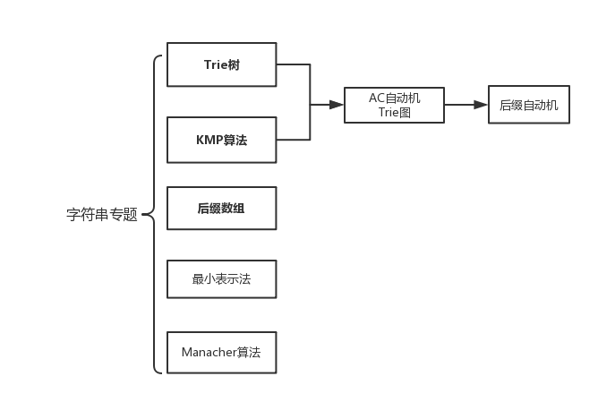

# 字符串相关问题与算法 #

## 目录 ##

  1. [**一种用于字符串集合的数据结构——Trie树**](Trie.md)
  2. [模式匹配问题——自动机家族](Automata.md)
    1. 从有向图到自动机
    2. **单模板串匹配问题——KMP算法**
    3. 多模板串匹配问题——AC自动机
    4. 后缀匹配问题——后缀自动机[^1]
    5. 回文匹配问题——回文自动机[^2]
  3. **后缀的最长公共前缀问题——后缀数组**
  4. 循环同构问题——最小表示法
  5. 最大回文串问题——Manacher算法

## 前言 ##
　　大概6月中旬的时候，本弱接到尹榛菲通知，暑假要讲课，从搜索、数据结构、DP、图论、数学、字符串六个专题里选出一个专题负责。在这些专题当中：图论内容太多，网络流、二分图、强连通分量、拓扑排序一类的深坑基本上不会，这方面必然是带不动诸位假学生，真·大佬；数学内容太深，且不论我懵懵懂懂的包括容斥原理、polya原理在内的组合数学，即使是数论同余那些概念，FFT的作用与实现还够我喝上一壶；DP就不说了，各种被廖神[^3]秒杀……

　　于是挑了个软柿子捏，有了这篇字符串的博客。

（以上是废话）

 

　　虽然说字符串问题相对来说思维强度和技巧性要求较低，但能把上面这么多内容都学习到位，也并不是一件容易的事情。目录中，加粗的三个内容是字符串问题最精华、最实用、竞赛考的最多，同时也是最灵活的三个问题。**Trie树**的出题非常灵活，**KMP**作为模板串匹配问题的经典算法被收录在CLRS中，**后缀数组**则是处理单个字符串信息强有力的工具连续在区域赛中出现。它们的重要性不言而喻。请读者优先学习这三方面的内容。

　　本篇教程**以问题为导向**，每个典型问题为一个学习单元。每个学习单元首先会系统性地介绍字符串的有关概念，讲解字符串的重点问题，之后会是它们的解决算法。在此之后，还有对各大算法的正确性证明与复杂性分析。在这篇教程中，每个学习单元将由下列四个部分组成：

 * 问题描述
 * 算法过程及实现
 * 正确性证明与复杂度分析
 * 相关文档

　　你能在问题描述中知晓该问题的背景知识和相关概念；在算法过程中了解各个算法的具体步骤，并有机会亲身实践它；如果你对教程中内容有所疑问，可以看看参考文献，看看笔者引用的资料是怎么写的。

　　最后要说一句，这是本人第一次写教程，水平有限，在教程中难免出现写的不清楚或是有纰漏的地方。如有问题或疑问，请不要犹豫，直接与我交流。如果您有对教程的修改意见或觉得教程有不足之处，欢迎提交修改，或在issue中提出。

[^1]:后缀自动机：由于本人能力有限，加之该内容所能解决的问题与后缀数组有相当的重合度，故暂时空置，等待补充。
[^2]:回文自动机：该内容相对冷门，一般较难遇到相关题目，故暂时空置，等待补充。
[^3]:廖神：指廖凌云，2016届Team Nebula队员。