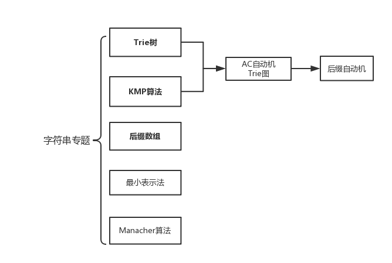
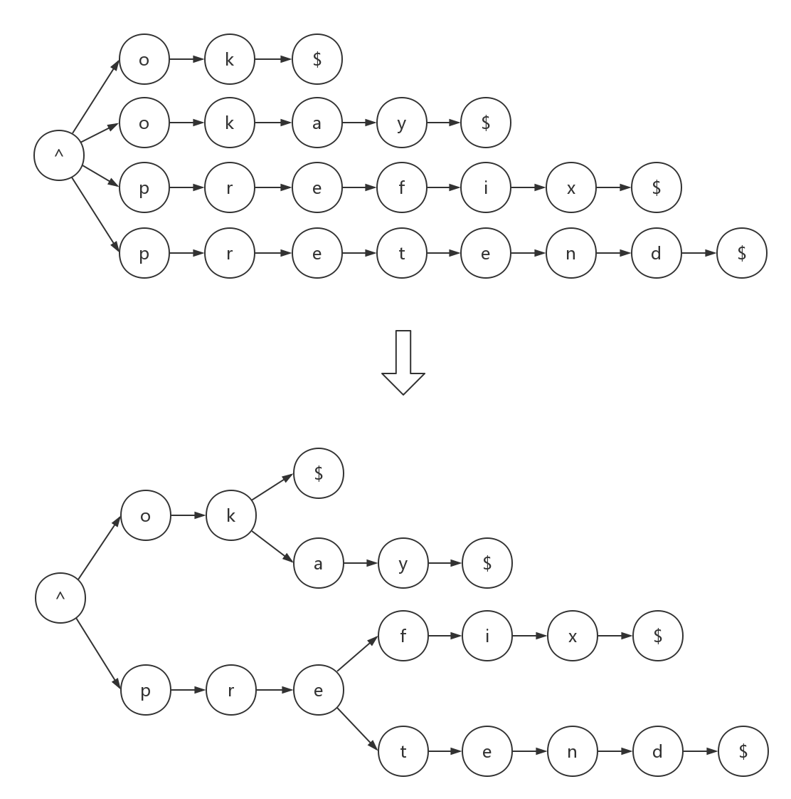

# 字符串相关问题与算法 #

## 目录 ##
  1. 前言——一些啰嗦的话
  2. **一种用于字符串集合的数据结构————Trie树**
  3. 循环同构问题————最小表示法
  4. 最大回文串问题————Manacher算法
  5. 模式匹配问题————自动机家族
    1. 从有向图到自动机
    2. **单模板串匹配问题————KMP算法**
    3. 多模板串匹配问题————AC自动机
    4. 后缀匹配问题————后缀自动机(*)
    5. 回文匹配问题————回文自动机(*)
  6. **后缀的最长公共前缀问题————后缀数组**

## 前言 ##

　　大概6月中旬的时候，本弱接到尹榛菲通知，暑假要讲课，从搜索、数据结构、DP、图论、数学、字符串六个专题里选出一个专题负责。在这些专题当中：
图论内容太多，网络流、二分图、强连通分量、拓扑排序一类的深坑基本上不会，这方面必然是带不动诸位假学生，真·大佬；数学内容太深，且不论我懵懵懂懂的包括容斥原理、polya原理在内的组合数学，即使是数论同余那些概念，FFT的作用与实现还够我喝上一壶；DP就不说了，各种被廖神秒杀……

　　于是挑了个软柿子捏，有了这篇字符串的博客。

（以上是废话）

 

　　虽然说字符串问题相对来说思维强度和技巧性要求较低，但能把上面这么多内容都学习到位，也并不是一件容易的事情。目录中，加粗的三个内容是字符串问题最精华、最实用、竞赛考的最多，同时也是最灵活的三个问题。**Trie树**的出题非常灵活，**KMP**作为模板串匹配问题的经典算法被收录在CLRS中，**后缀数组**则是处理单个字符串信息强有力的工具连续在区域赛中出现。它们的重要性不言而喻。请读者优先学习这三方面的内容。

　　本篇教程**以问题为导向**，每个典型问题为一个学习单元。每个学习单元首先会系统性地介绍字符串的有关概念，讲解字符串的重点问题，之后会是它们的解决算法。在此之后，还有对各大算法的正确性证明与复杂性分析。在这篇教程中，每个学习单元将由下列四个部分组成：

 * 问题描述
 * 算法过程及实现
 * 正确性证明与复杂度分析
 * 相关文档

　　你能在问题描述中知晓该问题的背景知识和相关概念；在算法过程中了解各个算法的具体步骤，并有机会亲身实践它；如果你对教程中内容有所疑问，可以看看参考文献，看看笔者引用的资料是怎么写的。

　　最后要说一句，这是本人第一次写教程，水平有限，在教程中难免出现写的不清楚或是有纰漏的地方。如有问题或疑问，请不要犹豫，直接与我交流。

## 一种用于字符串集合的数据结构——Trie树 ##

### 问题描述 ###

　　小明有一本字典。现在，小明想要知道自己前两天背诵过的若干个单词有没有记错，他需要背出脑海里的每一个单词，然后在字典中查找该单词是否存在。

　　已知字典共有n个单词（字典本身无序），每个单词长度不超过L。小明给出k个“单词”，对于每一个单词，你需要判断它是否在字典中存在。

**分析**

　　最朴素的办法是对每个“单词”，遍历整个字典，再比较单词与字典中每个词是否相同。时间复杂度为 $O(n \times m \times L)$ 。

　　在处理复数个字符串时，对字符串进行排序往往是一个行之有效的操作。字符串的字典序，对于字符串,先按首字符排序,如果首字符相同,再按第二个字符排序,以此类推。如：

    atcoder
    best
    bestcoder
    cf
    codeforces
    regional
    topcoder

就是字符串的一个递增序列。

　　因此，我们可以采用快速排序算法对字典进行排序，再利用二分搜索查询每个单词：
``` cpp
std::sort(dict, dict+n);//对字典排序，字典本身为一个容量为n的string数组
if(std::binary_search(dict, dict+n, word) )//查找某个单词
    std::cout<<"Yes, it is a word!"<<std::endl;
```
　　这是二分查找的经典姿势。普通的二分查找时间单词时间复杂度为$O(log n)$。但在字符串中，由于每次比较是$O(m)$的，每次二分查找的时间变为$O( L\times log n )$。相应的，整个算法的时间复杂度变为了$O( (n+k)\times L\times log n )$。

　　虽然说相对于朴素算法，这个算法对时间复杂度有了非常大的改善。但我们将会看到，利用Trie树，我们能在更短的时间内完成上述问题:

### 算法过程 ###

　　Trie树，又称字典树、单词查找树、前缀树，是一种树形结构。字典树的基本思想是缩点。例如，对于有序序列：

    ok
    okay
    prefix
    pretend

　　字典树将每个单词看做一个由单词中字母组成的链表。对于单词与单词中公共的节点部分，将它们缩成同一个节点：



注：图中“^"表示字符串开头，"$"表示字符串结尾。

　　通过这种方法，Trie树将相同的前缀“聚合”起来，后面将会看到，这种聚合能提高查找的效率。

　　可以看出，Trie是一颗**多叉树**，当前节点的“度数”取决于具有当前公共前缀的字符串集合的下一个字母种数。一颗Trie树中**节点的最大度数**等于**字符串字符集的大小**（如：不区分大小写的英语单词，它的字符集为26，表示a-z的26个字符）实际操作时，通常使用一个长度等于最大值的定长数组维护这种多叉关系，并用null表示该分支不存在：
```cpp
//Trie树的节点类
class Trienode{
    //儿子节点指针,
    Trienode *next[26];
public:
    Trienode(){
        //初始化时，节点的度数为0，next指针全部赋空值
        memset(next, 0, sizeof(next) );
        ...
    }
};
```
　　如此，Trie的每个节点无论其实际度数为何，占用空间都等于度数最大情况的空间消耗。这种操作造成一定程度上的空间浪费，但由于每个节点维护的是线性表，每个字符的查询时间为与字符集大小无关的常量，整个过程的时间复杂度较低，这一点将在紧接着的分析中得到体会。

　　一颗Trie树能完成下述三种操作（已知Trie树为dict，字符串为s）：

     * 查询操作：查询dict中是否存在s。若经过修改，Trie树可查询满足某些特定条件的字符串（如：与s哈夫曼距离最小的字符串si）
     * 动态插入：将字符串s插入dict中
     * 动态删除(*)：将字符串s从dict中删除

　　对于**查询操作**，每次取出字符串中的一个字符，调到当前节点对应字符的儿子节点，直到读到字符串末位，或对应的儿子节点不存在。
```cpp
//节点类的成员函数。s:查询的字符串，i:当前所处第几个字符
bool search(const char s[], size_t i = 0){
    //到达s的字符串尾部，表明成功找到了该字符串
    if(s[i]=='\0')
        return istail;

    //当前节点不具有相应儿子节点，表明该字符串不存在
    if(next[s[i]-'a'] == NULL)
        return false;

	//继续递归过程
    return next[s[i]-'a']->search(s, i+1);
}
```
　　对于**插入操作**，每次先查找dict中s的最长公共前缀，再将s的剩余部分插入到该节点之后。
```cpp
//s:查询的字符串，i:当前所处第几个字符
void insert(const char s[], size_t i = 0){
	//当前前缀的容量+1
    size++;

	//到达s的字符串尾部，表明插入过程结束
    if(s[i] == '\0'){
		//对节点的卫星数据赋值，表示该节点是一个字符串尾端
        istail = true;
        return;
    }

	//若相应儿子节点不存在，创建新的节点
    if(next[s[i]-'a'] == NULL)
        next[s[i]-'a'] = new Trienode;

    //继续递归过程
    next[s[i]-'a']->insert(s, i+1);
}
```
　　**删除操作**的实现需要借助额外的卫星数据。在每个节点上记录共有当前前缀的字符串数目size。首先，判断待删字符串s在Trie树中是否存在；然后，从叶子节点逐步往上回溯，并删除不再有效的节点。
```cpp
//s:查询的字符串，i:当前所处第几个字符
void erase(const char s[], size_t i = 0){
	//当前前缀容量-1
        size--;

    if(s[i]=='\0'){
        istail = false;
        return;
    }

	//先递归处理儿子
    next[s[i]-'a']->erase(s, i+1);

	//若儿子容量为0，删除该儿子，释放相应空间
    if(next[s[i]-'a']->size == 0){
        delete next[s[i]-'a'];
        next[s[i]-'a'] = NULL;
    }
}
```
　　至此，Trie树的全部基本功能已经全部讲解完毕。完整代码请看[基于递归与动态开辟内存的Trie树实现](sources/Trie.cpp)。注意，上述代码仅作理解用，实际过程中大量的动态内存操作与递归写法是非常费时的。为了避免这种结果，建议读者先读懂代码，再以迭代写法、手动开辟静态内存池并自行分配的方式重构。

### 正确性证明与复杂度分析 ###

　　从上面的分析，我们可以推知：对于查询、插入、删除中每个操作，利用Trie树处理时的时间复杂度为 $O(L)$ 。

　　要创建一个字典，只需依次将字符集的每个字符串插入Trie树，整个过程是 $O(n \times L)$ 的。注意到Trie树中各字符串是有序的，而建立Trie树的过程超越了快速排序算法的 $O(n \times L \times log n)$ 。这是由于Trie树采用了类似桶排序的方式，因而突破了基于比较的排序算法的下界。

　　接下来是对Trie树的空间消耗分析(*)。

  1. 由于Trie树每个节点需要存储大小等同于字符集大小的儿子指针，它的每个节点的空间消耗是相当大的。（如，对上例中的代码，每个节点存储$26$个指针，$1$个整形数，$1$个bool，其总空间为$112$字节）
  2. 可以推知，一般情况下重叠缩点的部分在Trie树中只占较小部分。对于给出的字符串集合，无论在最坏情况还是平均情况下Trie树所需的节点个数近似为 $n \times L$ 。

　　因此，Trie树总共的空间消耗约为：$n \times L \times (4\sigma+2)$字节。（例:对于示例中的Trie树，若$n \times L=1E6$，在32位机下该Trie的空间消耗为106MB）
### 相关文档 ###

 * [Trie树：应用于统计和排序](http://blog.csdn.net/hguisu/article/details/8131559)
 * [基于递归与动态开辟内存的Trie树实现](sources/Trie.cpp)
